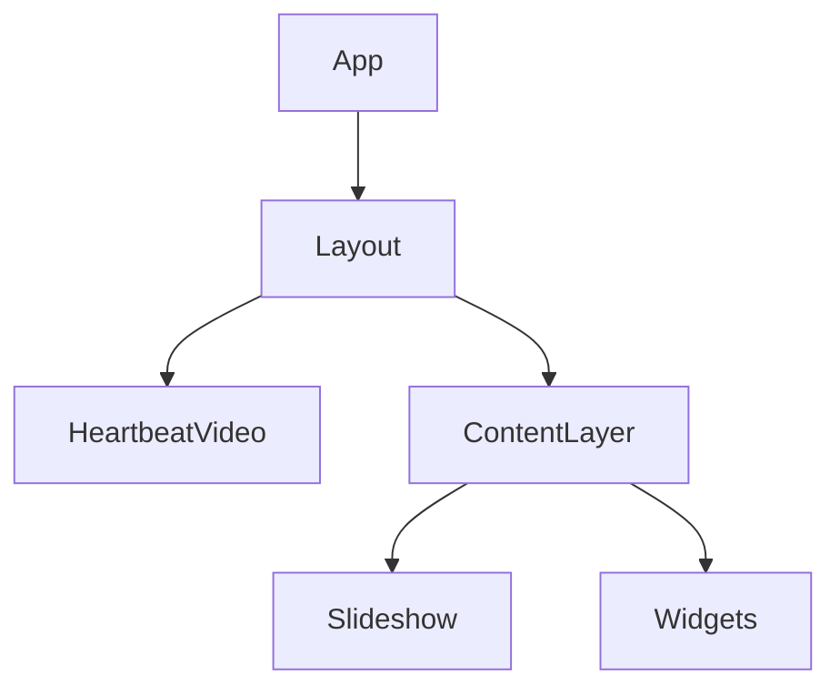

# SaveMyPortal Architecture

## Core Concept: The "Heartbeat" (T17)
The central technical challenge of the Facebook Portal (Gen 2) is its aggressive power management, which puts the device to sleep after ~15 minutes of inactivity.

Through extensive testing, we discovered that the Portal's OS respects **active, user-initiated media sessions**.

**The Solution**:
1.  **HeartbeatVideo**: A standard HTML5 `<video>` element plays a silent, looping MP4.
2.  **User Initiation**: The user MUST manually tap the screen once to start playback. This registers a "trusted user gesture."
3.  **Layering**: The video player is placed at `z-index: 50` (or greater) with `opacity: 0.001`. It must sit *above* the content layer.
    - *Why?* Modern Chrome WebViews (Chrome 98+) aggressive power management will pause videos that are fully occluded (covered by other DOM elements). By placing it on top but practically invisible, we trick the browser into rendering it.
4.  **Result**: The browser keeps the device awake because it believes a video is being watched.

## Component Structure

### HeartbeatVideo (`src/components/HeartbeatVideo.jsx`)
- **Responsibility**: Keep the device awake.
- **Implementation**: Renders a mute, loop, playsInline video. Exposes a `.play()` method.
- **Recovery**: Listens for `pause` or `ended` events to attempt auto-restart.

### Layout (`src/components/Layout.jsx`)
- **Responsibility**: Manage the stacking context and initial user interaction.
- **State**: Tracks whether the heartbeat has started.
- **Overlay**: Displays a "Tap to Start" screen until the user interacts.

## Scalability & Integrations

### Photo Storage
To make this "scalable" and "super accessible," we recommend the following approaches for the Slideshow component:

1.  **Local/Network URL (MVP)**: Allow users to input a URL to a JSON feed of image URLs.
2.  **Google Photos API**: Requires OAuth flow. Best for most users but complex setup.
3.  **Cloudflare R2 / AWS S3**: For "power users", pointing to a bucket.
4.  **Home Assistant**: If running as a fully managed kiosk, integration with HA media browser.

### Accessibility
Since Portals are often used by older generations:
- **Large Touch Targets**: All buttons should be min 48x48px (preferably 64px+).
- **High Contrast**: Ensure text is readable against photo backgrounds (use text shadows or scrims).
- **Simplified UI**: The "Photo Frame" mode should be zero-interaction once started.
